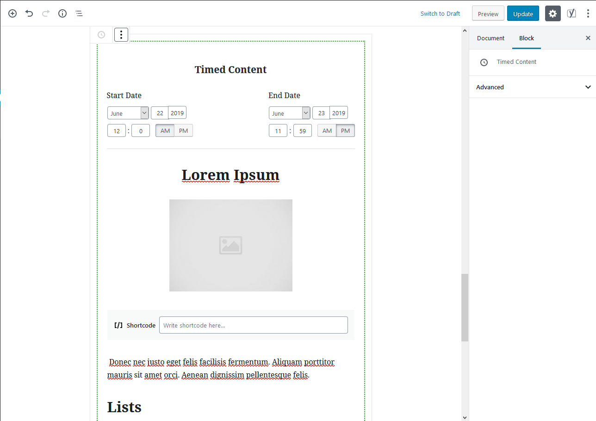

# Timed Content Block
> Schedual the display of content.

Choose a start and end date/time. Then, within the green box, create the page like you normaly would. You can utilize any other block WP has to offer.

If a page visitor isn't within the specified time window, the content will not display for them.

## Installation

Clone or download a zip of this repo, place in the /plugin folder of your WordPress installation, activate the plugin on the backend of WordPress.